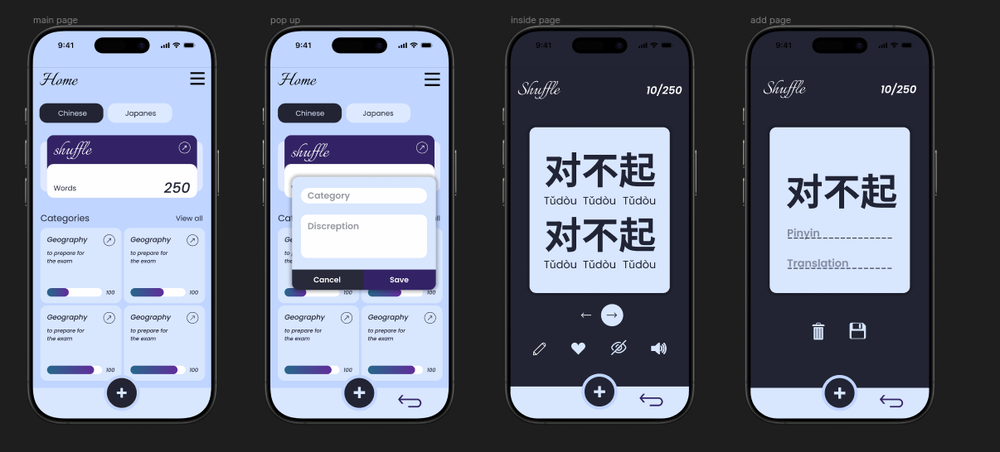

# Flashcard App for chinese learning

## Overview
A Flutter-based flashcard application designed for language learning and study, with a clean and modern UI. The app allows users to browse categories, study flashcards, and add new cards for effective learning.

## UI for beta version

